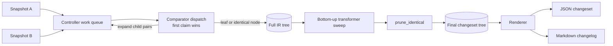

# Architecture overview

Binoc is a pipeline: two snapshots flow through a type-ignorant controller,
into format-aware comparators, through a tree of transformers, and out through
renderers. The sections below sketch each piece and link out to the deeper
explanation pages; the [ADR set](../adr/README.md) holds the long-form record
of design decisions.

## The story in one diagram



Five moving parts:

| Part | Role | Has format knowledge? |
|---|---|---|
| **Controller** | Dispatches item pairs through a work queue, assembles the diff tree, drives transformers. | No |
| **Comparators** | Parsers. Take raw data and emit IR (a leaf node, or an expansion into child item pairs). | Yes |
| **Transformers** | Optimization passes over the IR. Detect cross-cutting patterns (moves, reorders) without touching raw data. | Yes (about *patterns* in IR) |
| **Renderers** | Serialize the IR for a presentation surface (Markdown, JSON, HTML…). Apply significance classification. | Yes (about *output*) |
| **Config** | Decides which plugins run and in what order. | n/a |

For the conceptual model behind each part, see
[Plugin model](plugin-model.md). For the data flowing between them, see
[IR and changesets](ir-and-changesets.md).

## Three architectural commitments

Every design choice in binoc traces back to one of these:

### 1. The controller is type-ignorant

The controller has zero knowledge of files, directories, archives, or any data
format. Every format concept lives in a comparator. This is what makes binoc a
plugin-first system: the standard library is a plugin pack with no special
status, and a third-party plugin is on equal footing with `binoc.csv`.

This is enforced socially as much as technically — see
[`AGENTS.md`](https://github.com/harvard-lil/binoc/blob/main/AGENTS.md) for
the contributor-facing version.

### 2. Comparators parse, transformers optimize, renderers classify

The three plugin axes correspond to three phases of work:

- **Comparators** turn raw bytes into IR. They are the only plugins with raw
  data access.
- **Transformers** rewrite IR. They detect patterns (move detection,
  column-reorder collapsing) and add semantic tags. They cannot read raw data
  by default — they consume *artifacts* published by comparators. See
  [Artifacts and composition](artifacts-and-composition.md).
- **Renderers** decide what the IR *means* for a given output surface.
  Significance classification — clerical vs. substantive — is a renderer
  concern. See [Significance classification](significance-classification.md).

This split is not just hygiene; it is what enables cross-plugin composition.
A new comparator that publishes `tabular_v1` artifacts inherits all the
tabular analysis transformers for free.

### 3. The IR is openly typed

`action`, `item_type`, and `tags` are open enums and open string bags. There
are no built-in types. A genomics plugin can emit `action: "gap-shift"` and
`item_type: "fasta-alignment"` without touching core. Significance levels
likewise are not in the IR — they are mapped from tags by the renderer.

The IR is also *tree-structured*: every changeset is a tree of `DiffNode`
values, mirroring the recursive structure of the snapshots. The controller
walks the tree bottom-up so that transformers see children before parents.
See [IR and changesets](ir-and-changesets.md).

## How the pieces are arranged on disk

Binoc is a Rust workspace plus Python bindings:

| Crate | Role |
|---|---|
| `binoc-sdk` | The published Rust crate. Plugin traits, IR types, `DataAccess`, `export_plugin!` macro, C ABI wire types. The only Rust crate published to crates.io. |
| `binoc-core` | Controller loop, config, plugin registry, output functions. Internal — not published. |
| `binoc-stdlib` | Standard comparators and transformers. Architecturally identical to a third-party plugin pack (see [stdlib boundary ADR](../adr/2026-03-09-stdlib_boundary.md)). |
| `binoc-cli` | CLI library + standalone Rust binary. Re-used by Python via `binoc_cli::run(registry, args)`. |
| `binoc-python` | PyO3 bindings, Python plugin discovery, the `binoc` console script (the user-facing CLI). |
| `model-plugins/` | Reference plugin implementations: `binoc-sqlite` (Rust comparator), `binoc-row-reorder` (Rust transformer), `binoc-html` (Python renderer). |
| `test-vectors/` | Shared fixtures consumed by all crates. See [Test vectors](test-vectors.md). |
| `docs/` | This site. |

Build assumption: third-party plugins live in their own repos, are compiled
separately, and link against `binoc-sdk` exactly as the in-tree model plugins
do. The workspace layout is a convenience, not a coupling.

## How a plugin is loaded

Python owns *discovery*; Rust owns *execution*. At startup, the Python CLI
scans `importlib.metadata.entry_points(group="binoc.plugins")` and calls each
discovered `register(registry)` function. From that point on, all per-file
dispatch is a Rust trait-object vtable call, whether the plugin came from
stdlib, a Rust crate, or a Python class. See
[Plugin discovery ADR](../adr/2026-03-06-plugin_discovery.md) and
[Plugin SDK and ABI ADR](../adr/2026-03-12-plugin_sdk_and_abi.md).

```mermaid
flowchart LR
    SDK["binoc-sdk<br/>traits, IR, DataAccess,<br/>artifacts, descriptors"] --> CORE["binoc-core"]
    SDK --> STDLIB["binoc-stdlib"]
    SDK --> NATIVE["Native Rust plugin packs"]
    CORE --> CLI["binoc-cli"]
    CLI --> PY["binoc-python"]
    PY -->|default registry| STDLIB
    PY -->|entry-point register()| PYP["Python plugins"]
    PY -->|dlopen + C ABI + JSON| NATIVE
```

## Where to go next

- For the *what is a plugin* story → [Plugin model](plugin-model.md).
- For the *what is in the IR* story → [IR and changesets](ir-and-changesets.md).
- For *how comparators talk to transformers* → [Artifacts and composition](artifacts-and-composition.md).
- For *how the controller picks a plugin* → [Dispatch model](dispatch-model.md).
- For *what makes a change matter* → [Significance classification](significance-classification.md).
- For *how to get the actual changed data* → [Extract and provenance](extract-and-provenance.md).
- For *the full long-form record of every design decision* →
  [Architectural decisions (ADRs)](../adr/README.md).
