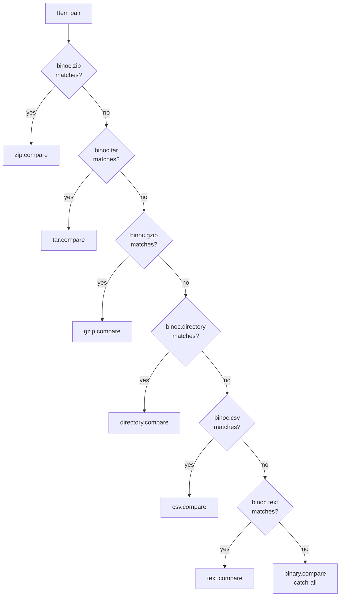
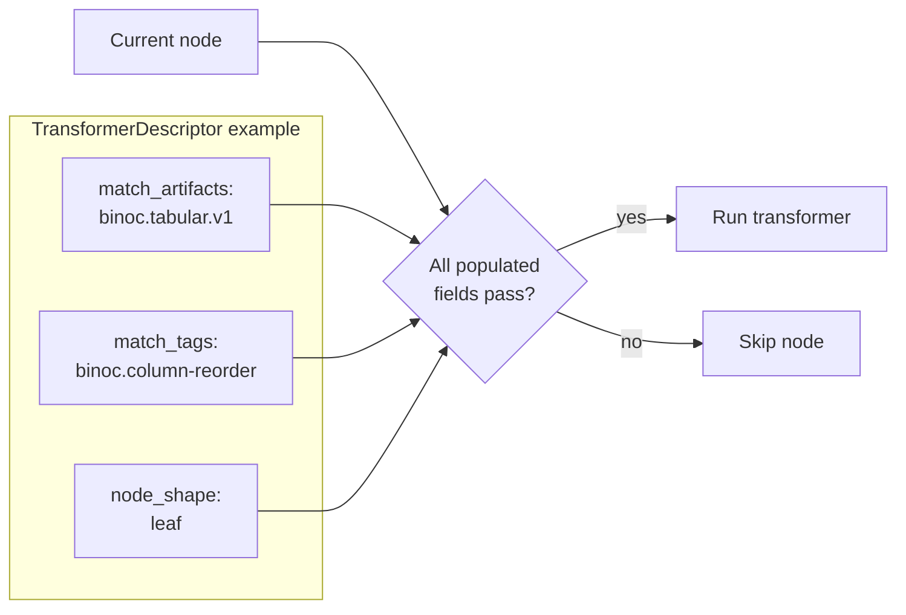

# Dispatch model

The controller's job is to take an item pair and pick a comparator to
handle it. Later, after the tree is built, it picks transformers to rewrite
each node. Both are *declarative-first* dispatch with an imperative escape
hatch — the design is deliberate, and the trade-offs are spelled out below.

## Comparator dispatch: first claim wins

Each comparator declares its dispatch criteria in a `ComparatorDescriptor`:

| Criterion | What it does |
|---|---|
| `extensions` | Match if the item's path ends with one of these. E.g. `[".csv", ".tsv"]`. |
| `media_types` | Match if the item's [detected media type](../adr/2026-03-05-media_type_detection.md) is one of these. |
| `scope` | `Files`, `Containers`, or `Either`. Containers are items that hold other items (directories, archives). |

If the descriptor lists no extensions and no media types, the comparator is
treated as a *catch-all* — it matches any item that satisfies the scope.
The binary comparator is the canonical catch-all.

The controller walks the comparator pipeline in order. For each comparator:

1. Does the descriptor match the item? (Extensions and media types are
   OR-ed; scope is a hard filter.)
2. If yes, dispatch the item pair to `compare()`.
3. If `compare()` returns `Skip`, try the next comparator.
4. Otherwise, the comparator's result is the answer.

This is **URL-routing semantics**: declared once, ordered by config, first
match wins. Plugins do not order each other; configuration does.

## Why no `can_handle` method?

An earlier design exposed `fn can_handle(&self, pair) -> bool` so a
comparator could inspect any aspect of the input before claiming. This
was rejected for two reasons:

1. **It collapses dispatch into per-comparator imperative checks.** The
   controller can't reason about the pipeline (e.g. "is anything declared
   to handle `.parquet`?") because every check is an opaque method call.
2. **It runs *every* comparator's check on *every* item.** Declarative
   descriptors are O(plugins) to register but O(1) to dispatch (extension
   table lookup); imperative checks are O(plugins) per item.

The escape hatch is the `Skip` result. If your comparator's descriptor
matches but it discovers at compare-time that the item isn't actually
suited (e.g. a `.db` file that turns out to be Berkeley DB, not SQLite),
return `CompareResult::Skip` and the controller tries the next candidate.

### What `Skip` costs

The skip path involves real work:

- The comparator was loaded.
- For separately-compiled plugins crossing the C ABI, the request was
  JSON-serialized and the response was deserialized.
- The comparator opened the file, inspected it, and bailed.

Design your descriptors to be specific enough that false matches are rare:

- Use precise file extensions (`.sqlite3` not `.db`) when possible.
- Use media types for content-based dispatch where extension is ambiguous.
- Use `scope: Containers` or `scope: Files` to avoid being dispatched for
  the wrong item shape.

If your plugin handles a format that genuinely requires content sniffing
(magic bytes), `Skip` is unavoidable — make the detection fast (read the
first few bytes, not the whole file).

## The default stdlib pipeline

Order matters. The default pipeline (from `DatasetConfig::default_config()`):

| # | Comparator | Claims by |
|---|---|---|
| 1 | `binoc.zip` | `.zip` extension |
| 2 | `binoc.tar` | `.tar`, `.tar.gz`, `.tgz` extensions |
| 3 | `binoc.gzip` | `.gz` extension |
| 4 | `binoc.directory` | `scope: Containers` |
| 5 | `binoc.csv` | `.csv`, `.tsv` extensions; scoped delimited-text media types |
| 6 | `binoc.text` | `.txt`, `.md`, `.rs`, and other text extensions |
| 7 | `binoc.binary` | catch-all (no extension/media type filter) |

Archive comparators come first because `.zip`/`.tar` extension matching has
to happen before the directory comparator claims the extracted contents. Tar
stays before gzip so `.tar.gz` is treated as a tar archive rather than a
single-stream gzip file.
CSV comes before text because `.csv` files should use the column-aware
comparator, not line-level diff. Binary is the catch-all fallback.

A custom dataset config can reorder, add, or remove any plugin. **This is
a config concern, not a plugin concern.**

## Content hash short-circuit

Before any comparator is dispatched, the controller checks one thing: do
both sides of the pair have matching content hashes? If yes, the result
is `Identical` immediately, no comparator runs.

This is what makes "diff a snapshot of mostly unchanged files" cheap. The
expanding comparators (directory, zip) pre-compute BLAKE3 hashes for all
their children at expansion time. Subsequent dispatch just looks at the
hashes. See the
[full comparison tree ADR](../adr/2026-03-05-full_comparison_tree_and_content_hashes.md).

A comparator that needs to see identical items (the zip comparator does,
to expand identical archives for structural visibility) opts in via
`handles_identical() -> true`.

## Transformer dispatch

Transformers are dispatched differently from comparators because they
operate on a finished tree, not on raw input.

Each transformer declares matching criteria in a `TransformerDescriptor`:

| Field | Meaning |
|---|---|
| `match_tags` | Match nodes carrying any of these tags. |
| `match_actions` | Match nodes with any of these `action` values. |
| `match_types` | Match nodes with any of these `item_type` values. |
| `match_artifacts` | Match nodes that have any of these artifact formats. |
| `node_shape` | `"any"`, `"container"`, or `"leaf"`. |

The controller dispatches to a transformer when **all** non-empty criteria
match (AND-of-ORs: within each field any value suffices, but every populated
field must match). See the
[transformer dispatch refinement ADR](../adr/2026-03-20-transformer_dispatch_refinement.md)
for the rationale.

Within each populated field, values are OR-ed (`.csv` **or** `.tsv`,
`tabular_v1` **or** some future `tabular_v2`). Across fields, the match is an
AND: adding `match_tags` narrows the transformer's applicability instead of
broadening it.

The tree is walked **bottom-up by default**. Children are transformed
first; then a transformer sees each matched node with its children already
in their final form. This is what makes correlation passes (move detection,
folder-move detection) work cleanly. A `Root` scope exists for tree-wide
walkers that need the full tree at once; see the
[transformer scope ADR](../adr/2026-04-16-transformer_scope_yagni.md) for why bottom-up
is the default.

After all transformers run, `prune_identical` removes the `identical`
nodes that the controller injected, leaving a clean delta to serialize.

## Where to go next

- For *who* gets dispatched and how to register them →
  [Plugin model](plugin-model.md).
- For *what* a comparator returns → [IR and changesets](ir-and-changesets.md).
- For the long-form record:
  [media type detection](../adr/2026-03-05-media_type_detection.md),
  [transformer dispatch refinement](../adr/2026-03-20-transformer_dispatch_refinement.md),
  [transformer scope (YAGNI)](../adr/2026-04-16-transformer_scope_yagni.md),
  [full comparison tree](../adr/2026-03-05-full_comparison_tree_and_content_hashes.md).
