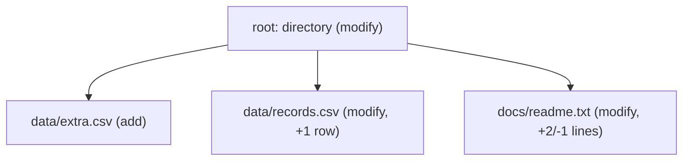
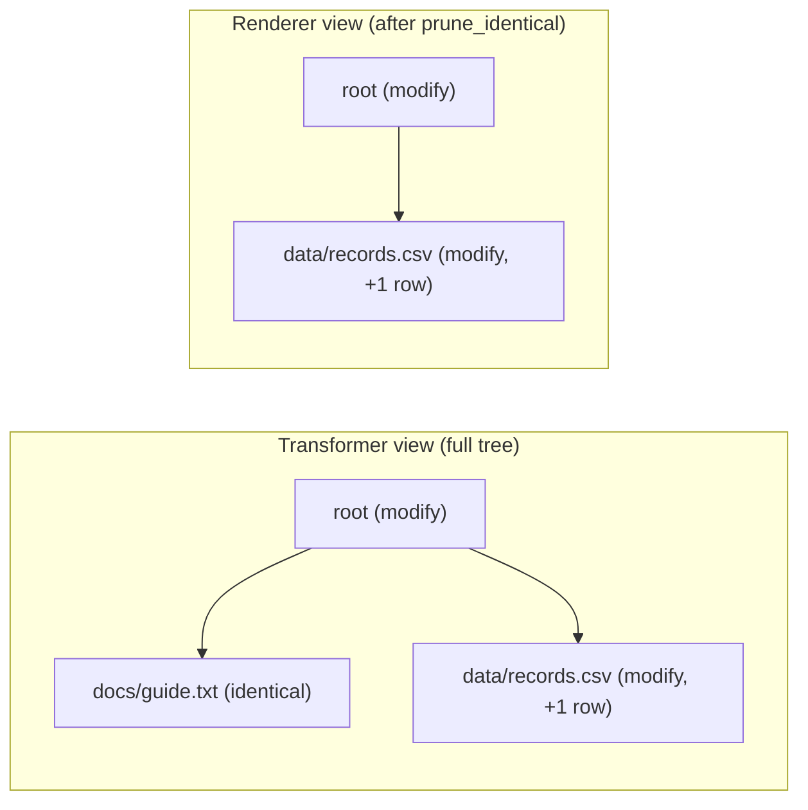

# IR and changesets

The **IR** (intermediate representation) is binoc's lingua franca. Every
comparator emits IR nodes; every transformer rewrites them; every renderer
consumes them. The IR is the contract — both within a single binoc run and
across releases — so understanding its shape is essential to writing plugins
or building a pipeline that consumes binoc's output.

## A changeset is a tree of `DiffNode` values

Each changeset is a single `DiffNode` (the root) with children, grandchildren,
and so on. The shape mirrors the input snapshots: a directory becomes a
container node with file children; a zip archive becomes a container node
with the archive's contents as children; a CSV file becomes a leaf with
column / row details.



## `DiffNode` fields

The full set of fields, defined in
[`binoc-core/src/ir.rs`](https://github.com/harvard-lil/binoc/blob/main/binoc-core/src/ir.rs):

| Field | Type | Purpose |
|---|---|---|
| `action` | open string | What happened: `"add"`, `"remove"`, `"modify"`, `"move"`, `"reorder"`, `"identical"`, … Plugins may define new values. |
| `item_type` | open string | What the item *is*: `"directory"`, `"file"`, `"tabular"`, `"zip_archive"`, … The core never interprets it. |
| `path` | string | Logical path within the snapshot, e.g. `"archive.zip/data/file.csv"`. |
| `source_path` | optional | For moves and renames: the original (left-side) path. |
| `summary` | optional | Human-readable one-liner ("2 lines added, 1 removed"). Set by comparators or transformers; rendered by renderers. |
| `tags` | set of strings | Semantic observations: `binoc.column-reorder`, `binoc.content-changed`, … Open and namespaced by convention. |
| `children` | list | Child diff nodes forming the tree structure. |
| `details` | map | Comparator-specific structured data (column lists, row counts, hashes). |
| `annotations` | map | Transformer-added metadata, kept separate from `details`. |
| `comparator` | optional | Which comparator produced this node — provenance for the [extract chain](extract-and-provenance.md). |
| `transformed_by` | list | Transformers that modified this node, in order — provenance for the extract chain. |
| `artifacts` | list of `ArtifactDescriptor` | Pointers to typed payloads published by comparators. See [Artifacts and composition](artifacts-and-composition.md). |

A few of these fields are *transient* — they exist during the live diff
session but are stripped on serialization. See the
[transient fields on wire ADR](../adr/2026-04-16-transient_fields_on_wire.md) for what
crosses the boundary and what doesn't.

## Three design commitments behind the IR

### Everything is openly typed

`action`, `item_type`, and `tags` are plain strings. They are *conventions*,
not enforced enums. A genomics plugin can emit `action: "gap-shift"` without
touching core. A pipeline integrator's downstream code can match on
`item_type == "tabular"` without binoc dictating an enum it has to keep up
with.

The trade-off is that the IR offers no static guarantees about the value of
these fields. The convention is to namespace custom values
(`biobinoc.fasta-alignment`, not `fasta-alignment`) so that pipelines that
care about precise dispatch can do so safely. See
[Vocabulary](vocabulary.md).

### Tags are facts, not judgments

Every tag in the IR is a *factual observation*: `binoc.column-reorder`
means "the columns were reordered" — not "this belongs under a particular
heading." Whether a column reorder is grouped as clerical, substantive, or
something custom is a *renderer* concern, mapped from tags via
configuration. See
[Significance classification](significance-classification.md).

This split is the reason a single dataset's binoc output can be read
differently by different audiences without re-running the diff: the same
changeset JSON can be rendered as a flat factual list or grouped output
depending on renderer config.

### The tree is structural, not just additive

The controller keeps `identical` nodes in the tree during transformer
execution and prunes them only at the end. This means a
copy-detection transformer can correlate an `add` node with an
unchanged file across the snapshot — that file is still in the tree.
See the
[full comparison tree ADR](../adr/2026-03-05-full_comparison_tree_and_content_hashes.md)
for why.



## What a changeset looks like on disk

A changeset on disk is JSON. The root node is the top-level object;
children nest naturally. The default Markdown renderer reads the tree and
produces a flat factual list:

```
# Changelog: snapshot-a → snapshot-b

- **data/records.csv**: 1 row added
- **data/extra.csv**: New table (2 columns, 1 row)
- **summary.csv**: Columns reordered (content unchanged)
```

With explicit renderer config, the same tree can instead be grouped under
literal headings in a declared order.

Pipeline integrators consume the JSON directly. The
[changeset JSON schema](../reference/changeset-schema.md) is the canonical
contract.

## Combining changesets

`binoc changelog changeset-1.json changeset-2.json …` reads multiple stored
changesets and produces a single changelog spanning all of them. The
combinator is just another renderer; it does not modify the IR.

This is the model for "dataset history" use cases: store one changeset per
release, combine them on demand to produce a release-spanning view.

## Where to go next

- For the cross-plugin composition mechanism that lives alongside details
  and tags → [Artifacts and composition](artifacts-and-composition.md).
- For how a node's `comparator` and `transformed_by` provenance fields are
  used → [Extract and provenance](extract-and-provenance.md).
- For the long-form ADRs:
  [transient fields on wire](../adr/2026-04-16-transient_fields_on_wire.md),
  [opportunistic ItemRef metadata](../adr/2026-04-16-opportunistic_itemref_metadata.md),
  [full comparison tree](../adr/2026-03-05-full_comparison_tree_and_content_hashes.md).
- For the JSON contract → [changeset schema reference](../reference/changeset-schema.md).
