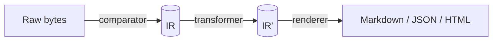

# Plugin model

A binoc plugin is a collection of comparators, transformers, and/or
renderers, packaged as a distribution unit. The sections below cover the *why*
behind the plugin model. For step-by-step instructions on building one, see
the [Write a Python comparator](../howto/write-a-python-comparator.md) and
[Write a Rust comparator](../howto/write-a-rust-comparator.md) recipes.

## The three plugin axes

Binoc plugins come in exactly three flavors, corresponding to the three
phases of work:

| Plugin | Input | Output | Has data access? |
|---|---|---|---|
| **Comparator** | An item pair (left, right) | A leaf `DiffNode`, an *expansion* into child item pairs, `Identical`, or `Skip`. | Yes — `DataAccess` |
| **Transformer** | A `DiffNode` (and its already-transformed children) | `Unchanged`, `Replace(node)`, `ReplaceMany(nodes)`, or `Remove`. | Sometimes — via *artifacts* and `source_items` |
| **Renderer** | A finished changeset tree | A serialized output stream | No — works on IR only |

This split is not just hygiene. It is what makes plugins compose. A new
comparator that publishes a tabular artifact inherits every tabular-aware
transformer for free; see [Artifacts and composition](artifacts-and-composition.md).

## What each axis is for

### Comparators are the parser

A comparator turns raw bytes into IR. It is the only plugin type with a
`DataAccess` handle and the only place where format knowledge lives at the
byte level. Comparators have two productive modes:

- **Leaf**: emit a `DiffNode` describing the change and stop. This is what a
  CSV comparator does — it parses both files and emits a node whose
  `details` describe the column / row delta.
- **Expand**: produce a list of child item pairs to be re-queued. This is
  what a directory or zip comparator does — it discovers the children and
  hands them back to the controller for normal dispatch.

A comparator can also return `Identical` (no change) or `Skip` (this
comparator can't actually handle this item; try the next one in the
pipeline). See [Dispatch model](dispatch-model.md) for what `Skip` costs.

### Transformers are optimization passes

A transformer rewrites the completed diff tree. It runs *after* every
comparator has produced a node, and the controller walks the tree bottom-up
so that a transformer always sees children in their final form.

Typical transformer jobs:

- **Pattern detection across siblings.** The
  [`CorrelationDetector`](https://github.com/harvard-lil/binoc/blob/main/binoc-stdlib/src/transformers/correlation.rs)
  notices an `add` and a `remove` with matching content hashes and rewrites
  them as a single `move` leaf.
- **Pattern detection within a node.** The
  [`ColumnReorderDetector`](https://github.com/harvard-lil/binoc/blob/main/binoc-stdlib/src/transformers/column_reorder.rs)
  notices a tabular `modify` whose only change is column ordering and
  rewrites the action to `reorder`.
- **Cross-plugin enrichment.** The
  [`TabularAnalyzer`](https://github.com/harvard-lil/binoc/blob/main/binoc-stdlib/src/transformers/tabular_analyzer.rs)
  reads `tabular_v1` artifacts published by *any* tabular comparator and
  attaches semantic tags, summary text, and details. This is how Parquet or
  Excel comparators (today they don't exist; tomorrow they might) will get
  tabular analysis without writing it again.

### Renderers serialize and classify

A renderer takes a finished changeset and produces a presentation-format
output: Markdown changelog, JSON, HTML, RSS, anything. Renderers are also
where **significance classification** lives when a presentation wants it —
the mapping from semantic tags (facts) to categories like "clerical" or
"substantive" (judgments).
This is a deliberate placement: see
[Significance classification](significance-classification.md).

## Python or Rust?

Both are first-class. Pick based on your data and your audience:

| If you... | ...write a Python plugin | ...write a Rust plugin |
|---|---|---|
| ...want to prototype quickly | ✓ |  |
| ...are doing computation in NumPy / pandas / scientific libraries | ✓ |  |
| ...need raw `DataAccess` (publish artifacts, scratch workspace) |  | ✓ (Python plugins have a simplified interface) |
| ...need `source_items` re-parse from a transformer |  | ✓ |
| ...are diffing thousands of files where per-file GIL cost matters |  | ✓ |
| ...want zero per-file overhead via the C ABI |  | ✓ |
| ...are willing to maintain a `cdylib` build |  | ✓ |

Python plugins integrate via PyO3 at startup. Rust plugins integrate via
the published [`binoc-sdk`](../reference/sdk.md) crate, compile to a
`cdylib`, and are loaded via a stable C ABI at startup. After startup,
both kinds of plugins look identical to the controller. See the
[Plugin SDK and ABI ADR](../adr/2026-03-12-plugin_sdk_and_abi.md) for the boundary
design.

## How discovery works

`pip install some-binoc-plugin` is the natural distribution gesture for
binoc's audience. Discovery uses Python entry points, even for Rust
plugins:

1. Plugin packages declare a `binoc.plugins` entry point in
   `pyproject.toml`.
2. At binoc startup, `importlib.metadata.entry_points(group="binoc.plugins")`
   enumerates every installed plugin.
3. Each plugin's `register(registry)` function is called, populating the
   `PluginRegistry` with comparator/transformer/renderer trait objects.
4. From that point on, all per-file dispatch is a Rust vtable call. Python
   is involved exactly once, at startup.

`Config.add_comparator()` is the scripting escape hatch — a Jupyter
notebook can register a plugin object directly without packaging anything.

For the full discovery design, see the
[Plugin discovery ADR](../adr/2026-03-06-plugin_discovery.md). For the entry-point
spec, see [reference/plugin-discovery.md](../reference/plugin-discovery.md).

## What belongs in `binoc-stdlib` vs. a separate plugin

The standard library is itself just a plugin pack. The
[stdlib boundary ADR](../adr/2026-03-09-stdlib_boundary.md) spells out the criteria
for promoting something to stdlib:

1. Structural necessity (containers, fallbacks) or audience expectation
   (CSV).
2. Modest dependency cost (pure Rust, no bundled C libraries).
3. Sustainable long-term maintenance under the `binoc.*` namespace.

In practice: containers (directory, zip, tar), universal fallbacks (text,
binary), and CSV are stdlib. SQLite, Parquet, Excel, FASTA, and similar
domain formats live in their own plugin packs.

## Naming and namespacing

To prevent collisions across plugin packs, namespace your plugin's
identifiers:

| Thing | Convention | Examples |
|---|---|---|
| Plugin names | `package.name` | `biobinoc.fasta`, `climate.netcdf` |
| Tags | `package.tag-name` | `biobinoc.sequence-changed`, `binoc.column-reorder` |
| Item types | `package.type-name` | `biobinoc.fasta-alignment`, `binoc.tabular` |
| Actions | Standard actions unnamespaced; custom actions namespaced | `add`, `remove`, `modify` (standard); `biobinoc.gap-shift` (custom) |

Standard `binoc.*` names are reserved for the standard library.

## Where to go next

- For the cross-plugin composition mechanism →
  [Artifacts and composition](artifacts-and-composition.md).
- For *how* the controller picks a plugin →
  [Dispatch model](dispatch-model.md).
- For the actual code →
  [Write a Python comparator](../howto/write-a-python-comparator.md) /
  [Write a Rust comparator](../howto/write-a-rust-comparator.md).
- For packaging → [Publish a plugin](../howto/publish-a-plugin.md).
