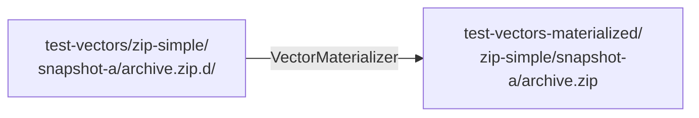

# Test vectors

A **test vector** is a self-contained directory under `test-vectors/` that
exercises one capability of binoc end-to-end. Each vector ships:

- `snapshot-a/` and `snapshot-b/` — the input directories to diff.
- `manifest.toml` — what the vector tests, which comparators and
  transformers to run, and structural assertions on the output IR.
- Optional gold files — expected serialized output, checked by exact
  comparison.

Vectors are named for **what they test**, not how. `csv-column-reorder`,
not `test-comparator-csv-3`. They double as documentation.
If you want runnable user-facing examples rather than the architectural
story, see the [Examples gallery](test-vectors-gallery.md).

## Why vectors are a first-class concept

A vector is the smallest reproducible unit of binoc behavior. Every
plugin-relevant claim in the documentation can — and where possible
should — be backed by a vector that demonstrates it. The
[snapshot testing ADR](../adr/2026-03-05-snapshot_testing_for_test_vectors.md)
spells out why this beats unit-test-only coverage:

- Vectors are inspectable. A contributor can `ls test-vectors/` and read
  what each one does.
- Vectors survive IR schema evolution. Structural assertions in the
  manifest (`root_action`, `child_count`, `has_tags`) are checked first;
  gold files are a secondary signal.
- Vectors are shared across crates. `binoc-stdlib`, `binoc-python`, and
  every plugin in `model-plugins/` runs the same vectors through the
  same harness.

## Materialization: source trees, not opaque binaries

A vector that diffs a `.zip` archive can't commit the archive directly —
binary blobs in version control are opaque, drift, and bloat the repo.
Instead, vectors commit *source trees* (`archive.zip.d/`,
`data.sqlite.d/*.sql`) that get built into real artifacts on demand.



Both `just test` (via the test harness) and `just materialize` (which
produces a gitignored `test-vectors-materialized/` tree) go through the
same `VectorMaterializer` plugin trait. The stdlib ships
`ZipMaterializer`, `TarMaterializer`, and `GzipMaterializer`; plugins
contribute their own (see `binoc_sqlite::test_support::SqliteMaterializer`).

The materialized tree is byte-for-byte what tests diff. The how-to
[Test a plugin with vectors](../howto/test-a-plugin-with-vectors.md)
covers the implementation details for plugin authors. For the design
rationale and the rejected alternatives (commit the binaries; use Git
LFS; generate at test time only), see the
[test vector materialization ADR](../adr/2026-04-16-test_vector_materialization.md).

## Anatomy of a manifest

```toml
[vector]
name = "csv-column-reorder"
description = "Columns shuffled, content identical"
tags = ["csv", "column-reorder", "clerical"]

[config]
comparators = ["binoc.directory", "binoc.csv"]
transformers = ["binoc.tabular_analyzer", "binoc.column_reorder_detector"]

[expected]
root_kind = "modify"
child_count = 1
has_tags = ["binoc.column-reorder"]
significance = "clerical"
```

Three sections:

- `[vector]` — metadata. `name` and `description` show up in test
  output; `tags` are for filtering.
- `[config]` — which plugins to run. By controlling this per-vector, a
  vector can isolate exactly the comparator-transformer combination it's
  exercising.
- `[expected]` — structural assertions on the resulting IR. These are
  the primary check.

## Sharing the harness with plugins

The
[plugin test-vector harness ADR](../adr/2026-03-09-plugin_test_vector_harness.md)
established that plugins should not have to re-implement the runner.
`binoc-stdlib` exposes `discover_vectors`, `run_vector`, and
`stdlib_materializers` under the default `test-vectors` feature. A plugin
in its own repo depends on `binoc-stdlib`'s `test-vectors` feature and
calls these functions with its own registry and its own materializers
appended to the stdlib list.

The model plugin
[`binoc-sqlite`](https://github.com/harvard-lil/binoc/tree/main/model-plugins/binoc-sqlite)
is the canonical example. See the
[Test a plugin with vectors](../howto/test-a-plugin-with-vectors.md)
how-to for the recipe.

## Default vectors plus plugin-owned vectors

Stdlib vectors live in `test-vectors/` at the repo root. Each plugin
owns its own `test-vectors/` directory under its crate. The
[test vector defaults ADR](../adr/2026-03-09-test_vector_defaults_and_plugin_vectors.md)
covers why this works: each crate's `cargo test` discovers its own
vectors plus, optionally, the stdlib's. There is no global registry to
coordinate.

## When a vector should be added

The architecturally cheapest way to contribute is to add a vector. New
vector for any:

- new comparator or transformer (to demonstrate the new behavior),
- bug fix (to lock in the regression test),
- edge case (to make the corner explicit).

Vectors live forever. They are the project's most durable form of
documentation.

## Where to go next

- Browse the [Examples gallery](test-vectors-gallery.md) for runnable
  examples backed by the shared workspace vectors.
- The how-to: [Test a plugin with vectors](../howto/test-a-plugin-with-vectors.md).
- The long-form design records:
  [snapshot testing for test vectors](../adr/2026-03-05-snapshot_testing_for_test_vectors.md),
  [test vector materialization](../adr/2026-04-16-test_vector_materialization.md),
  [plugin test-vector harness](../adr/2026-03-09-plugin_test_vector_harness.md),
  [test vector defaults and plugin vectors](../adr/2026-03-09-test_vector_defaults_and_plugin_vectors.md).
