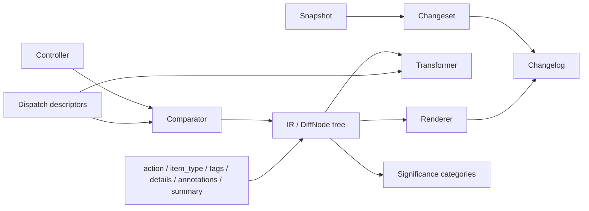

# Vocabulary

Binoc introduces a number of domain-specific terms, collected below for quick
lookup. For the rejected alternatives and the reasoning behind each choice,
see the [terminology ADR](../adr/2026-03-18-terminology.md).

## Core objects

| Term | Meaning |
|---|---|
| **Snapshot** | A set of files representing a dataset's state at a point in time. The unit of input to `binoc diff`. |
| **Changeset** | The stored finalized IR: a structured, tree-shaped description of how one snapshot differs from the next. The unit of output from `binoc diff`. |
| **Changelog** | A human-level summary rendered from one or more changesets. The unit of output from `binoc changelog`. |
| **IR** | *Intermediate representation.* The tree of `DiffNode` values produced by comparators and rewritten by transformers. Every changeset is a serialized IR tree. See [IR and changesets](ir-and-changesets.md). |

## Program components

| Term | Meaning |
|---|---|
| **Controller** | The work loop. Dispatches item pairs to comparators, assembles the diff tree, runs transformers. Has zero format knowledge. |
| **Comparator** | A plugin that claims an item pair and either emits a leaf diff or expands into child item pairs. Comparators are *parsers*. |
| **Transformer** | A plugin that rewrites the completed diff tree (IR → IR). Transformers are *optimization passes*. |
| **Renderer** | A plugin that renders changesets into a presentation format (Markdown, JSON, HTML, …). |
| **Porcelain** | Borrowed from git: the user-facing CLI layer over the library. |

## Comparison mechanics

| Term | Meaning |
|---|---|
| **Item pair** | The two-sided input to a comparator: a left item (old) and a right item (new). Either side may be absent for adds and removes. |
| **Left / right** | The two sides of an item pair, by convention "old" and "new." |
| **Claim** (verb) | How a comparator wins dispatch. The first comparator in the pipeline whose descriptor matches an item pair "claims" it. |
| **Expand / Leaf** | The two productive comparator outputs: *Expand* into child item pairs (recursive), or produce a *Leaf* diff (terminal). |
| **Logical path** | The user-meaningful path within a snapshot, including interior paths like `archive.zip/data/file.csv`. |

## IR fields

See [IR and changesets](ir-and-changesets.md) for the full picture.

| Field | Meaning |
|---|---|
| **action** | Open enum describing what happened: `add`, `remove`, `modify`, `move`, `reorder`, … Plugins may define new values. |
| **item_type** | Open string describing what the item *is*: `directory`, `file`, `tabular`, `zip_archive`, … |
| **tags** | Open bag of semantic strings attached to nodes by comparators and transformers. The primary mechanism for cross-plugin classification. |
| **details** | Comparator-specific payload on a diff node (column lists, row counts, hashes). |
| **annotations** | Transformer-added metadata, kept separate from `details`. |
| **summary** | Optional human-readable one-liner describing the change. |

## Significance

| Term | Meaning |
|---|---|
| **Clerical** | Changes that are mechanically necessary but semantically unimportant: column reordering, whitespace normalization, encoding changes. |
| **Substantive** | Changes that alter the information content: added columns, removed rows, schema changes. |

These are the *default* category names in the Markdown renderer; they are not
baked into the IR. Any renderer or dataset config can define its own
categories. See [Significance classification](significance-classification.md).

## Plugin distribution

| Term | Meaning |
|---|---|
| **Plugin pack** | A distribution unit of comparators, transformers, and/or renderers (e.g. `binoc-sqlite`, a hypothetical `biobinoc`). |
| **Standard library / stdlib** | The built-in plugin pack (`binoc-stdlib`). Architecturally identical to any third-party pack. |
| **Open enum / open bag** | The extensibility model for `action`, `item_type`, and `tags` — plugins can define new values without modifying core types. |

## Testing

| Term | Meaning |
|---|---|
| **Test vector** | A self-contained directory with two snapshots, a manifest, and optional expected output, exercising one capability. |
| **Gold file** | An optional expected-output file in a test vector, checked by exact comparison. Structural assertions in the manifest are the primary check. |
| **Materializer** | A plugin trait (`VectorMaterializer`) that builds a real artifact (a `.zip`, `.tar.gz`, `.sqlite`) from a committed source tree (`*.zip.d/`, `*.sqlite.d/`). See [Test vectors](test-vectors.md). |
