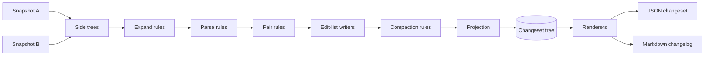

# Architecture overview

Binoc compares two dataset snapshots by building correspondences between items,
deriving edit lists for those correspondences, compacting those edits into a
shorter explanation, and projecting the result as a changeset tree for
renderers. The controller remains type-ignorant: it drives a generic
correspondence engine and never knows about directories, archives, CSV, text, or
any other format.

The [ADR set](../../adr/README.md) holds the long-form record of design
decisions. The current engine is defined by the
[correspondence-first engine ADR](../../adr/2026-06-12-correspondence_first_engine.md).

## The story in one diagram

The moving parts:

| Part | Role | Has format knowledge? |
|---|---|---|
| **Controller** | Creates the run, hands snapshots to the correspondence engine, and renders/extracts results. | No |
| **Expand rules** | Discover children inside containers such as directories, zip, tar, and gzip streams. | Yes |
| **Parse rules** | Turn source bytes into typed artifacts such as tabular data. | Yes |
| **Pair rules** | Propose correspondences between left and right items. | Sometimes |
| **Edit-list writers** | Convert a correspondence and its artifacts into open-vocabulary edits. | Yes |
| **Compaction rules** | Rewrite edit lists to shorter, more meaningful explanations. | About edit semantics |
| **Projection annotators** | Add projection hints for the final changeset tree. | About facts, not scheduling |
| **Renderers** | Serialize the projected changeset for JSON, Markdown, HTML, or another surface. | About output |

For the conceptual model behind plugin packs, see
[Plugin model](plugin-model.md). For the data flowing through the public
changeset, see [IR and changesets](ir-and-changesets.md).

## Three architectural commitments

### 1. The controller is type-ignorant

The controller has zero knowledge of files, directories, archives, or data
formats. The standard library is a plugin pack with no special status in the
engine, and third-party rule packs register through SDK-owned traits.

This is enforced by review as well as code. See `AGENTS.md` and the
`lint-plugin` agent checklist for the contributor-facing contracts.

### 2. Correspondence first, projection last

The engine does not build a merged comparison tree and then patch it with
tree-surgery passes. It keeps two side trees, establishes links between side
items, derives edits for each link, then projects the linked edit lists as a
changeset tree.

That split is why rename-and-modify, copy-aware pairing, declared
correspondences, and nested extract all use one model. A pair rule decides
whether two items correspond; a writer decides which edits explain that link; a
compaction rule can replace noisy edits with a shorter claim when the engine's
cost check says the rewrite is strictly better.

### 3. The IR is openly typed

`action`, `item_type`, `tags`, edit verbs, and evidence kinds are open
vocabularies. A genomics plugin can emit `action: "gap-shift"` and
`item_type: "fasta-alignment"` without touching core. Significance levels are
not in the IR; renderers map semantic facts into user-facing groups.

The changeset is still tree-structured because that is the format users and
renderers consume. The tree is a projection of correspondences, not the engine's
internal source of truth.

## How the pieces are arranged on disk

Binoc is a Rust workspace plus Python bindings:

| Crate | Role |
|---|---|
| `binoc-sdk` | Published Rust crate. Plugin-facing traits, IR types, correspondence rule traits, `DataAccess`, descriptors, and ABI helpers. |
| `binoc-core` | Controller, config, plugin registry, correspondence driver, projection, and output functions. Internal; not published. |
| `binoc-stdlib` | Standard rule pack and renderers. Architecturally identical to a third-party pack. |
| `binoc-cli` | CLI library and standalone Rust binary. |
| `binoc-python` | PyO3 bindings, Python plugin discovery, and the `binoc` console script. |
| `model-plugins/` | Reference plugin implementations. |
| `test-vectors/` | Shared fixtures consumed by all crates. See [Test vectors](test-vectors.md). |
| `docs/` | This site. |

## How a plugin is loaded

Python owns discovery; Rust owns execution. At startup, the Python CLI scans
`importlib.metadata.entry_points(group="binoc.plugins")` and calls each
discovered `register(registry)` function. Rust rule packs can also be registered
in process by code that embeds the library.

The stable ABI tier is intentionally narrower than the in-process rule surface
during pre-1.0. Renderers are stable; correspondence rule families graduate to
the ABI only after their trait signatures and vocabularies settle. See the
[tiered plugin surface ADR](../../adr/2026-06-12-tiered_plugin_surface_pre_1_0.md).

## Where to go next

- For the plugin-pack story: [Plugin model](plugin-model.md).
- For rule dispatch: [Dispatch model](dispatch-model.md).
- For typed artifacts: [Artifacts and composition](artifacts-and-composition.md).
- For extract: [Extract and provenance](extract-and-provenance.md).
- For renderer-side classification:
  [Significance classification](../../users/explanation/significance-classification.md).
- For the decision log: [Architectural decisions](../../adr/README.md).
