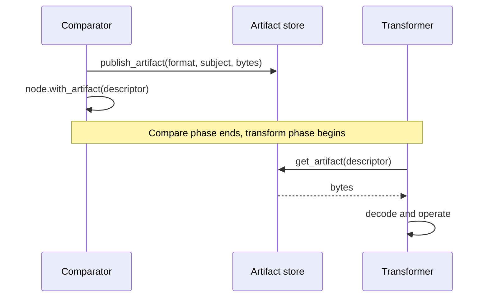
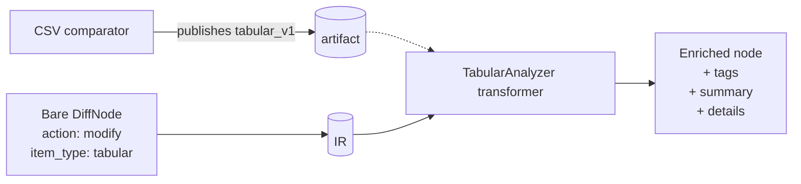
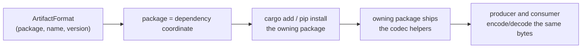

# Artifacts and composition

Comparators and transformers run in different phases. Comparators have raw
data access; transformers don't. Yet a transformer often needs to reason
about *content* that a comparator parsed — to decide whether a tabular diff
is purely a column reorder, or to enrich a node with content-derived tags.

The mechanism that bridges the two phases is **typed artifacts**. A
comparator publishes structured data once; downstream transformers consume
it without re-parsing.

## The shape of an artifact

An artifact has three pieces:

| Piece | What it is | Example |
|---|---|---|
| **Format** | A typed identifier: `(package, name, version)`. Stable across plugin versions. | `("binoc", "tabular", 1)` |
| **Subject** | Which side of the diff the data came from: `Left`, `Right`, or `Both`. | `Left` |
| **Bytes** | An opaque payload encoded per the format's schema. | A JSON-serialized `TabularData` |

Comparators **publish** artifacts on a node. Transformers **read** them
back via `data.get_artifact(descriptor)`.

The store is filesystem-backed under `<data_root>/.artifacts/`, which means
data written by the host is visible to separately-compiled plugins sharing
the same `data_root` across the C ABI boundary. Artifacts are
[transient session data](../../adr/2026-04-16-transient_fields_on_wire.md) — they are
not serialized into the changeset JSON.

## The thin-comparator pattern

The standard library demonstrates the canonical pattern:

The CSV comparator parses the file into a `TabularData` value, publishes
a `tabular_v1` artifact, and emits a *bare* node — action, item type,
artifacts, but no tags or summary. Then the format-agnostic
`TabularAnalyzer` transformer reads the artifact and adds all the
semantic tags, details, and summary text.

The pay-off: any *future* comparator that publishes `tabular_v1` (a
Parquet comparator, an Excel comparator, a pandas-DataFrame-from-Python
comparator) gets the entire tabular analysis pipeline for free. The
comparator owns *parsing*; the transformer owns *interpretation*.

## Format identifiers are package-rooted, not strings

An artifact format is `(package, name, version)`, not a dotted string
like `"tabular.v1"`. The `package` field is a package name resolvable
through the language's normal package system:

| Format | Owned by | Plugin authors depend on |
|---|---|---|
| `("binoc", "tabular", 1)` | the `binoc` SDK package | `binoc-sdk` |
| `("binoc-csv", "table", 1)` | a hypothetical `binoc-csv` package | `binoc-csv` |
| `("biobinoc", "fasta-records", 1)` | the `biobinoc` plugin pack | `biobinoc` |

This means a plugin author who sees `tabular_v1` in someone else's code can
mechanically determine which package to depend on for the codec.

The `version` is a single integer. Bump it only for breaking schema changes;
adding optional fields does not require a bump.

For the design rationale and the rejected alternatives, see the
[published artifacts ADR](../../adr/2026-03-19-published_artifacts_for_cross_plugin_composition.md).

## Public vs. private artifacts

The same storage and API support both:

- **Public artifacts** have a documented, stable format. They are the
  cross-plugin composition contract. `tabular_v1` is the canonical example.
- **Private artifacts** are plugin-internal: they let a comparator
  share parsed data with its own dedicated transformer (or with itself
  during the extract chain) without re-parsing. Their format is undocumented
  and subject to change.

The distinction is purely social — there is no "public" flag in the API.
Document a format if you want to invite cross-plugin reuse; leave it
undocumented if it's an implementation detail.

## When `source_items` is the right tool

Every node carries `source_items`: a reference to the original `ItemPair`
the comparator saw. A transformer that needs raw bytes — for hashing, for
example — can re-read the source via `data.read_bytes(item)` or
`data.local_path(item)`.

Prefer artifacts over `source_items` when your data requires parsing.
Artifacts avoid redundant re-parsing across multiple transformers and
enable cross-plugin composition. Use `source_items` only when:

- You need raw byte access (e.g. hashing for move detection).
- The comparator doesn't publish a suitable artifact for what you need.
- You're writing a transformer that operates on every node regardless of
  type and can't realistically depend on a specific artifact format.

For the boundary policy and rejected alternatives, see the
[transformer composition and artifact flow ADR](../../adr/2026-03-20-transformer_composition_and_artifact_flow.md).

## Composing across plugins

The same artifact format flowing through multiple plugins is the model for
ecosystem-scale composition:

- A `binoc-parquet` plugin publishes `("binoc", "tabular", 1)` artifacts.
- A `binoc-tabular-stats` transformer consumes `tabular_v1` artifacts and
  adds statistical-significance tags.
- The user installs both. Without writing any glue, `binoc diff` on
  `.parquet` files produces a node enriched by both plugins.

This is the m + n + o promise from
[Why binoc exists](../../users/explanation/why-binoc-exists.md), made concrete.

## Where to go next

- The reference: `binoc-sdk` types `ArtifactFormat`, `ArtifactSubject`,
  `ArtifactDescriptor`, helper constructors like `tabular_v1()`. See the
  [Rust SDK reference](../reference/sdk.md).
- A worked example: the SQLite plugin publishes its own private artifact
  format. See the [model-plugins/binoc-sqlite source](https://github.com/harvard-lil/binoc/tree/main/model-plugins/binoc-sqlite).
- The full design record:
  [published artifacts for cross-plugin composition](../../adr/2026-03-19-published_artifacts_for_cross_plugin_composition.md),
  [transformer composition and artifact flow](../../adr/2026-03-20-transformer_composition_and_artifact_flow.md).
