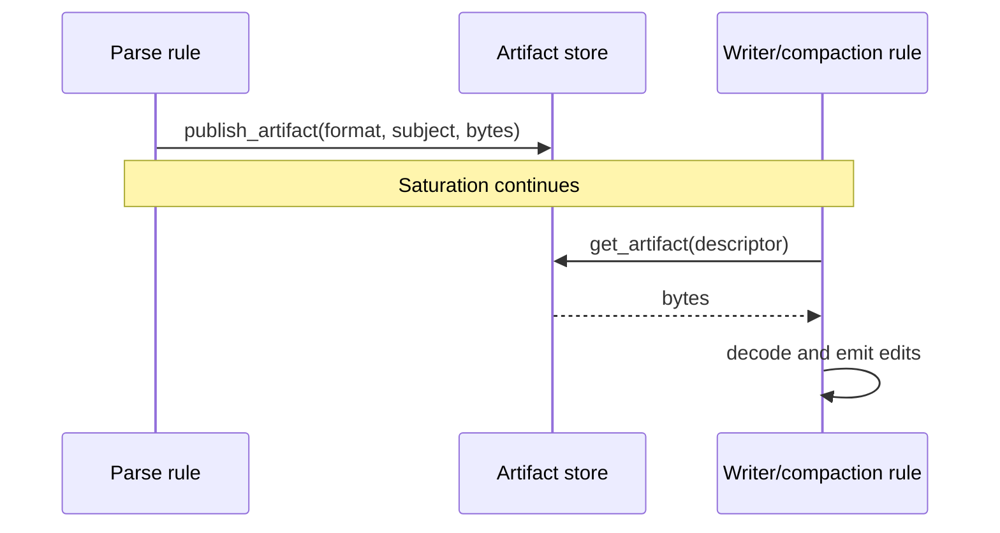
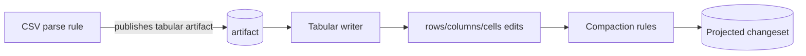

# Artifacts and composition

Artifacts are typed payloads that let one rule family parse data once and
another rule family reason about it without learning the original file format.
They are the main composition mechanism between parsers, pair rules, writers,
and compaction rules.

## The shape of an artifact

An artifact has three pieces:

| Piece | What it is | Example |
|---|---|---|
| **Format** | A typed identifier: `(package, name, version)`. Stable across plugin versions. | `("binoc", "tabular", 1)` |
| **Subject** | Which side of the diff the data came from: `Left`, `Right`, or `Both`. | `Left` |
| **Bytes** | An opaque payload encoded per the format's schema. | JSON-serialized tabular data |

Parse rules publish artifacts through `DataAccess`. Later rules read them back
by descriptor. The payload schema belongs to the package named in the format.

Artifacts are transient session data under the run's data root. They are not
serialized into the changeset JSON. Saved changesets can still support extract
because extract reruns the correspondence engine against the original snapshots
and asks the owning writer to produce the requested aspect.

## The parser/writer pattern

The standard library demonstrates the canonical tabular pattern:

The CSV parse rule owns CSV syntax. The tabular writer owns the generic tabular
edit vocabulary. A future Parquet, Excel, or statistical-data parser that
publishes the same public tabular artifact can reuse the same writer and
compaction rules.

## Format identifiers are package-rooted

An artifact format is `(package, name, version)`, not an ad hoc string. The
`package` field is a dependency coordinate:

| Format | Owned by | Plugin authors depend on |
|---|---|---|
| `("binoc", "tabular", 1)` | the `binoc` SDK/stdlib surface | `binoc-sdk` |
| `("binoc-csv", "table", 1)` | a hypothetical `binoc-csv` package | `binoc-csv` |
| `("biobinoc", "fasta-records", 1)` | the `biobinoc` plugin pack | `biobinoc` |

The version is a single integer. Bump it only for breaking schema changes;
adding optional fields does not require a bump.

For the design rationale, see the
[published artifacts ADR](../../adr/2026-03-19-published_artifacts_for_cross_plugin_composition.md).

## Public vs. private artifacts

The same storage and API support both:

- **Public artifacts** have documented stable schemas and are meant for
  cross-plugin reuse. `binoc.tabular.v1` is the current example.
- **Private artifacts** are implementation details shared inside a plugin pack.

There is no public/private bit in the API. The distinction is whether the owner
documents the format and treats it as a compatibility contract.

## Producer-kind checks

A shared artifact format does not identify the producer. A specialized writer
or compaction rule that only understands one producer's payload must check that
producer kind itself and decline foreign payloads so a generic fallback can run.

Use this whenever a specialized rule claims a format that other plugins can also
publish. The SQLite table-collection writer is the reference pattern: it checks
for SQLite collection metadata before emitting SQLite-specific projection.

## When source items are the right tool

Rules can also inspect source items through `DataAccess` when raw bytes are the
right abstraction, such as hashing, content sniffing, or expanding containers.
Prefer artifacts when the data requires parsing:

- Artifacts avoid redundant parsing across multiple rules.
- Artifacts provide a schema-first contract across plugin packs.
- Artifacts keep generic rules from embedding every source parser they might
  ever consume.

## Where to go next

- The reference: `binoc-sdk` types `ArtifactFormat`, `ArtifactSubject`,
  `ArtifactDescriptor`, `tabular_v1`, and helper codecs. See the
  [Rust SDK reference](../reference/sdk.md).
- The design records:
  [published artifacts for cross-plugin composition](../../adr/2026-03-19-published_artifacts_for_cross_plugin_composition.md),
  [correspondence-first engine](../../adr/2026-06-12-correspondence_first_engine.md).
