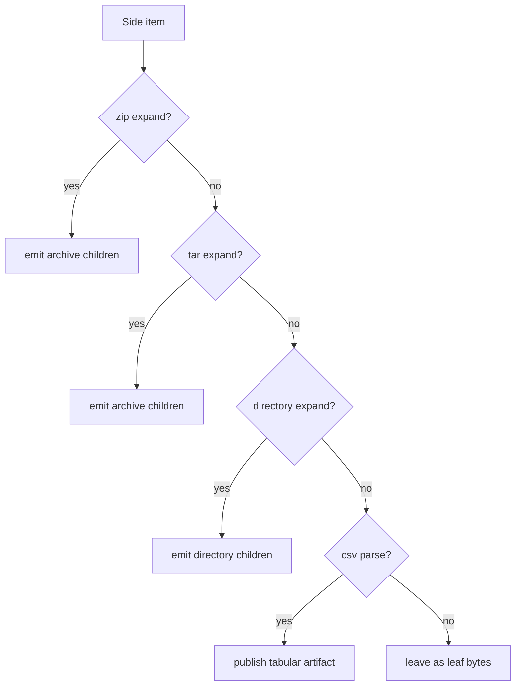

# Dispatch model

The correspondence engine dispatches by rule family. Each family declares the
cheap facts the engine can use up front, then has a narrow imperative escape
hatch for cases where the descriptor matched but the payload is not really the
specialized shape the rule understands.

Dispatch remains ordered by configuration. Plugins do not order each other;
registries and dataset configuration do.

## Rule families

| Family | Dispatch basis | Output |
|---|---|---|
| **Expand rules** | Source item selectors, container shape, extension/media facts | Child items on one side tree |
| **Parse rules** | Source item selectors and artifact format | Typed artifact bytes |
| **Pair rules** | Live engine view and declared evidence vocabulary | Link proposals |
| **Edit-list writers** | Artifact formats and link shape | Edits for one correspondence |
| **Compaction rules** | Edit-list shape and cost decrease | Rewritten edit list |
| **Projection annotators** | Projected node facts | Projection hints |

The retired two-phase taxonomy does not map one-to-one onto these families. A
format parser may provide expand, parse, pair, and writer rules. A
pattern detector may provide a pair rule, a compaction rule, or a projection
annotator.

## Expand and parse dispatch

Expand and parse descriptors should be as specific as correctness allows, and
the first rule that successfully claims a concrete output wins for that family.

Rules should not claim broad extensions and then do expensive detection for
every file. Use cheap selectors first; reserve imperative checks for unavoidable
content sniffing or producer-kind filtering.

## Producer-kind self-filtering

Artifact format alone does not say who produced the payload. A specialized rule
or writer that claims a shared format must prove the producer kind it expects.
If the payload is foreign, return `None` so dispatch falls through to the
generic fallback.

This matters for table collections. A SQLite collection writer and a generic
tabular collection writer may both understand a collection-shaped artifact. The
SQLite-specific writer must check that the collection came from SQLite before it
projects SQLite-specific summaries; otherwise it would misrender collections
from Excel, SAS, or a future plugin.

## Pair-rule dispatch

Pair rules run over the live correspondence view. They propose links rather
than directly mutating the final changeset.

Every pair rule declares:

- `name`: the stable rule identifier.
- `emits`: every evidence string it can put on a `LinkProposal`.
- `sees_beneath_settled`: whether the rule can inspect descendants under
  settled links.

The driver fails closed if a pair rule emits undeclared evidence. Mechanical
lints catch empty or duplicate evidence declarations before vector coverage has
to exercise every branch.

Pair proposals are deterministic. Given the same snapshots and config, rules
must produce the same candidate links, evidence, settled flags, and ordering.

## Writers, compaction, and projection

Edit-list writers choose how to explain one live correspondence. A writer
dispatches on the link's artifacts and item shape, emits open-vocabulary edit
verbs, and records any extract aspects it owns.

Compaction rules are optimization passes over edit lists. The driver accepts a
rewrite only when it strictly reduces cost; non-decreasing rewrites are rejected
before projection. This keeps compaction from becoming a second unbounded
scheduling system.

Projection turns the surviving edit lists into the user-facing changeset tree.
Projection annotators may adjust factual hints such as item type, action, tags,
or source path, but they do not change pairing or edit ownership.

## Current stdlib order

The standard rule pack is ordered roughly as:

1. Pair by hash, declared correspondences, same-name children, fuzzy evidence,
   container-from-child evidence, and root.
2. Expand zip, tar, gzip, and directories.
3. Parse CSV into tabular artifacts.
4. Write tabular, tabular-collection, text, container, then fallback edits.
5. Compact column reorders and row-addition summaries.
6. Annotate projection with stdlib tags and item types.

The exact order lives in `binoc_stdlib::correspondence::default_engine_config`.
Dataset config can add semantics such as declared file correspondences, row
identity, and the `expand_renamed_unchanged_collections` performance setting.

## Where to go next

- For the rule-pack overview: [Architecture overview](architecture.md).
- For typed payloads between rules: [Artifacts and composition](artifacts-and-composition.md).
- For the long-form design record:
  [correspondence-first engine](../../adr/2026-06-12-correspondence_first_engine.md),
  [tiered plugin surface](../../adr/2026-06-12-tiered_plugin_surface_pre_1_0.md).
