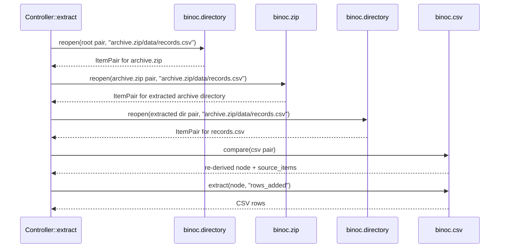

# Extract and provenance

A changeset tells you *what* changed: "two rows were added to `data.csv`."
Often you also want the actual data: *which* rows? `binoc extract` is the
answer — but it works only because every node in the IR remembers exactly
how it was produced. This is the **provenance** story.

## What `binoc extract` does

```bash
binoc extract changeset.json data.csv rows_added
```

reopens the original snapshots, walks the comparator chain that produced
the node at path `data.csv`, and asks the responsible plugin to format the
requested aspect (`rows_added`, `diff`, `content`, `column_order`, …).
The output is data — actual CSV rows, an actual unified diff, actual
bytes — not a summary.


Extract requires:

1. **The changeset JSON.** The `comparator` and `transformed_by`
   provenance fields tell extract which plugin to consult.
2. **Both original snapshots.** Extract is *re-derivation*, not *replay
   from a stored payload* — the snapshots are the source of truth.
3. **The same plugins installed** as when the changeset was generated.
   Without the original comparator, extract can't reopen the data.

## Provenance fields on `DiffNode`

Two fields make extract possible:

| Field | What it records |
|---|---|
| `comparator` | The name of the comparator that produced this node (e.g. `"binoc.csv"`). |
| `transformed_by` | The list of transformer names that subsequently rewrote this node, in order. |

When extract needs to format the `rows_added` aspect of a CSV diff, it
finds the leaf node at the target path, reads `comparator: "binoc.csv"`,
and dispatches to that comparator's `extract()` method. The comparator
gets back a `DataAccess` handle for the original snapshot files and is
expected to produce the requested aspect.

For nested containers — a CSV inside a zip inside a directory — extract
walks the chain from the root down: the directory comparator reopens the
zip; the zip comparator extracts the CSV; the CSV comparator handles the
final `rows_added` request. Provenance at each level tells the
controller which plugin to invoke.



For the design rationale and the rejected alternatives (storing the
changed payload in the changeset itself, replaying transformers, …), see
the [provenance and extract ADR](../../adr/2026-03-05-provenance_and_extract.md).

## Aspects

Different node types support different aspects. The convention is that
each comparator advertises a small vocabulary that its `extract()` method
understands:

| Node type | Common aspects |
|---|---|
| `tabular` (CSV, future Parquet, …) | `rows_added`, `rows_removed`, `cells_changed`, `columns_added`, `columns_removed`, `column_order`, `content` |
| `text` | `diff` (unified diff), `content_left`, `content_right`, `content` |
| `binary` | `content` |

A plugin can define new aspects for its own item types. Extract is
deliberately under-specified about what aspects must exist — it is up to
each plugin author to decide what is meaningful for their format.

## Why provenance, not stored payloads?

A naive design would store the changed payload (the added rows, the
unified diff) in the changeset JSON itself. Rejected because:

- **Changesets stay small.** A changeset for a snapshot with thousands of
  changed rows would balloon to megabytes. Provenance + extract keeps the
  changeset proportional to the *structure* of the change, not its
  *volume*.
- **Aspects are open-ended.** A user can ask for `cells_changed` weeks
  after the changeset was produced, even if the original render never
  showed that aspect. With provenance, the comparator computes it on
  demand.
- **Plugins evolve.** A plugin that adds a new aspect later (e.g. CSV
  gains `cells_changed_with_context`) can serve it from old changesets.
  Stored payloads would be frozen at generation time.

## When extract isn't possible

Extract fails when:

- The original snapshots are no longer available.
- The comparator that produced a node is no longer installed.
- The aspect requested doesn't exist for the node type. (Returns a clear
  error: `comparator 'binoc.text' cannot extract aspect 'X' from node 'Y'`.)

For workflows that need to ship the *content* of a diff to a downstream
consumer who won't have the original snapshots, run extract *at generate
time* and store the result alongside the changeset.

## Where to go next

- The how-to: [Extract changed data](../../users/howto/extract-changed-data.md).
- The long-form design records:
  [provenance and extract](../../adr/2026-03-05-provenance_and_extract.md),
  [cross-phase data cache](../../adr/2026-03-05-cross_phase_data_cache.md).
- The CLI reference for `binoc extract`: [CLI reference](../../users/reference/cli.md).
