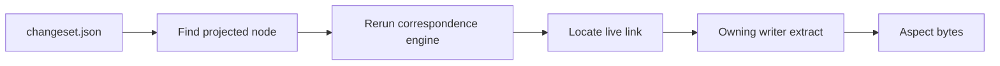

# Extract and provenance

A changeset tells you what changed: "two rows were added to `data.csv`." Often
you also want the actual data: which rows? `binoc extract` answers that by
rerunning the correspondence engine against the original snapshots and asking
the writer that owns the projected node to format the requested aspect.

## What `binoc extract` does

```bash
binoc extract changeset.json data.csv rows_added
```

The command:

1. Parses the saved changeset and finds the requested projected node.
2. Reopens both original snapshots.
3. Reruns the correspondence engine with the current stdlib/plugin rule config.
4. Locates the live correspondence link for the saved node path/source path.
5. Calls the owning writer's `extract` hook for the named aspect.

The output is data: CSV rows, a unified diff, content bytes, or another
plugin-defined aspect. It is not a summary string.



Extract requires:

- **The changeset JSON.** It identifies the projected node and requested path.
- **Both original snapshots.** Extract is re-derivation, not replay from a
  stored payload.
- **Compatible rule packs installed.** The writer that owns the aspect must be
  available.

## Ownership

Projection records enough internal link information for the controller to find
the live correspondence on rerun. The writer that projected the node owns its
extract aspects unless a compaction rule changes the aspect semantics and takes
ownership explicitly.

Current stdlib ownership examples:

| Node/edit family | Common aspects | Owner |
|---|---|---|
| Tabular rows/cells/columns | `rows_added`, `rows_removed`, `cells_changed`, `columns_added`, `columns_removed`, `column_order`, `content` | `TabularWriter` |
| Text content | `diff`, `content_left`, `content_right`, `content` | `TextWriter` |

Nested containers do not need serialized reopen chains in the changeset. The
engine rebuilds the side trees from the original snapshots, including expanded
archives, then resolves the live link by path/source identity.

## Why re-derive instead of store payloads?

Storing the changed payload in the changeset JSON is tempting, but it creates
bad defaults:

- **Changesets stay small.** A snapshot with thousands of changed rows should
  not produce a huge JSON file just because one user might later ask for rows.
- **Aspects are open-ended.** A writer can add a new aspect later and serve it
  from old changesets as long as the original snapshots are available.
- **Extraction stays format-owned.** The rule pack that understands the artifact
  decides how to serialize the aspect.

## When extract is not possible

Extract fails when:

- The original snapshots are unavailable.
- The rule pack that owns the writer/aspect is unavailable or incompatible.
- The requested aspect does not exist for the projected node.
- The saved path/source identity cannot be matched on rerun.

Workflows that need to send extracted content to someone without the original
snapshots should run extract at generation time and store the result beside the
changeset.

## Where to go next

- The how-to: [Extract changed data](../../users/howto/extract-changed-data.md).
- The current design records:
  [correspondence-first engine](../../adr/2026-06-12-correspondence_first_engine.md),
  [provenance and extract](../../adr/2026-03-05-provenance_and_extract.md).
- The CLI reference: [CLI reference](../../users/reference/cli.md).
