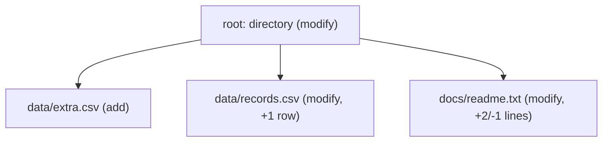

# IR and changesets

The changeset IR is binoc's user-facing contract. The correspondence engine
uses side trees, links, artifacts, edit lists, and compaction internally; after
that work is complete, it projects the result as a tree of `DiffNode` values for
renderers and downstream tools.

Understanding the projected tree is essential if you write renderers, consume
changeset JSON, or add rule-pack output that should survive serialization.

## A changeset is a tree of `DiffNode` values

Each changeset has one root `DiffNode` with children, grandchildren, and so on.
The shape is structural and user-facing: directories and archives become
containers, tabular files become leaves or table-collection children, and content
changes become detail blocks under the relevant node.



The tree is a projection, not the engine's internal source of truth. Pairing,
copy awareness, and edit compaction happen before projection.

## `DiffNode` fields

The full set of fields is defined in `binoc-sdk/src/ir.rs`.

| Field | Type | Purpose |
|---|---|---|
| `action` | open string | What happened: `"add"`, `"remove"`, `"modify"`, `"move"`, `"reorder"`, `"identical"`, or a plugin-defined value. |
| `item_type` | open string | What the item is: `"directory"`, `"file"`, `"tabular"`, `"zip_archive"`, or a plugin-defined value. Core does not schedule on it. |
| `path` | string | Logical path within the snapshot, e.g. `"archive.zip/data/file.csv"`. |
| `sources` | list | Renderer-visible provenance records with path, side, and optional evidence/action. Moves, copies, merges, and deduplications use the same shape. |
| `summary` | optional | Human-readable one-liner set during projection. |
| `tags` | set of strings | Semantic observations such as `binoc.column-reorder` or `binoc.content-changed`. |
| `children` | list | Child diff nodes forming the projected tree. |
| `details` | map | Structured data for the projected change. |
| `annotations` | map | Renderer/plugin metadata kept separate from details. |
| `detail_blocks` | list | Structured sections and extract hints for renderer-controlled verbosity. |
| `diagnostics` | list | Reportable warnings/errors associated with the node. |
| `source_items` | transient | Live source-item provenance used during a run. Stripped from user-facing JSON. |
| `artifacts` | transient | Live artifact descriptors used by rules during a run. Stripped from user-facing JSON. |

## Three design commitments behind the IR

### Everything is openly typed

`action`, `item_type`, tags, evidence kinds, and edit verbs are plain strings by
convention. A plugin can introduce `action: "biobinoc.gap-shift"` without
changing core.

Namespace custom values so downstream pipelines can distinguish plugin-owned
facts from standard `binoc.*` facts. See
[Vocabulary](../../users/explanation/vocabulary.md).

### Tags are facts, not judgments

Every tag is a factual observation. `binoc.column-reorder` means the columns
were reordered; it does not say whether that change is important. Renderer
config maps tags into headings or other presentation choices.

This split lets the same changeset JSON serve multiple audiences without
rerunning the diff.

### Projection is lossy by design

The projected tree is optimized for explanation, not for replaying the engine.
It omits unchanged internal links, transient artifacts, and rejected compaction
attempts. When a user asks for extracted data later, binoc reruns the
correspondence engine against the original snapshots and resolves the projected
node back to a live link.

## What a changeset looks like on disk

A changeset on disk is JSON. The root node is the top-level object; children
nest naturally. The default Markdown renderer reads the tree and produces a
flat factual list:

```text
# Changelog: snapshot-a -> snapshot-b

Claims: none

- **data/records.csv**: 1 row added
- **data/extra.csv**: New table (2 columns, 1 row)
- **summary.csv**: Columns reordered (content unchanged)
```

With explicit renderer config, the same tree can be grouped under literal
headings in a declared order.

Pipeline integrators consume the JSON directly. The
[changeset JSON schema](../../users/reference/changeset-schema.md) is the
canonical serialized contract.

## Combining changesets

`binoc changelog changeset-1.json changeset-2.json ...` reads multiple stored
changesets and produces a single changelog spanning all of them. The
combination is a renderer operation; it does not modify the stored IR.

## Where to go next

- For typed payloads used before projection: [Artifacts and composition](artifacts-and-composition.md).
- For extract ownership: [Extract and provenance](extract-and-provenance.md).
- For the current engine design:
  [correspondence-first engine](../../adr/2026-06-12-correspondence_first_engine.md).
- For the JSON contract:
  [changeset schema reference](../../users/reference/changeset-schema.md).
