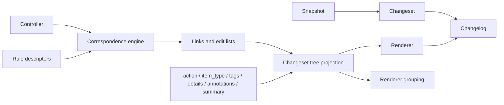

# Vocabulary

Binoc introduces a number of domain-specific terms, collected below for quick
lookup. For the rejected alternatives and the reasoning behind each choice,
see the [terminology ADR](../../adr/2026-03-18-terminology.md).

## Core objects

| Term | Meaning |
|---|---|
| **Snapshot** | A set of files representing a dataset's state at a point in time. The unit of input to `binoc diff`. |
| **Changeset** | The stored finalized IR: a structured, tree-shaped description of how one snapshot differs from the next. The unit of output from `binoc diff`. |
| **Changelog** | A human-level summary rendered from one or more changesets. The unit of output from `binoc changelog`. |
| **IR** | *Intermediate representation.* The stored changeset tree of `DiffNode` values projected from correspondence links and edit lists. See [IR and changesets](../../plugin-developers/explanation/ir-and-changesets.md). |

## Program components

| Term | Meaning |
|---|---|
| **Controller** | The host loop. Builds the run, invokes the correspondence engine, and renders/extracts results. Has zero format knowledge. |
| **Correspondence engine** | The type-ignorant engine that builds side trees, proposes links, writes edit lists, compacts them, and projects a changeset tree. |
| **Rule pack** | A plugin package that contributes one or more correspondence rule families. |
| **Renderer** | A plugin that renders changesets into a presentation format (Markdown, JSON, HTML, …). |
| **Porcelain** | Borrowed from git: the user-facing CLI layer over the library. |

## Comparison mechanics

| Term | Meaning |
|---|---|
| **Side item** | One item in either the left or right side tree. |
| **Item pair** | A left/right pair used at API boundaries and for links. Internally the engine stores side items separately and links correspondences between them. |
| **Left / right** | The two sides of a comparison, by convention "old" and "new." |
| **Link** | A correspondence between one left item and one right item. |
| **Evidence** | An open string explaining why a pair rule proposed a link. |
| **Edit list** | The open-vocabulary edits emitted for one link before projection. |
| **Expand** | A correspondence rule family that discovers children inside a container. |
| **Parse** | A correspondence rule family that turns source bytes into typed artifacts. |
| **Pair** | A correspondence rule family that proposes links between side items. |
| **Writer** | A correspondence rule family that explains one link as edits. |
| **Compaction** | A correspondence rule family that rewrites edit lists only when the replacement strictly reduces cost. |
| **Logical path** | The user-meaningful path within a snapshot, including interior paths like `archive.zip/data/file.csv`. |

## IR fields

See [IR and changesets](../../plugin-developers/explanation/ir-and-changesets.md) for the full picture.

| Field | Meaning |
|---|---|
| **action** | Open enum describing what happened: `add`, `remove`, `modify`, `move`, `reorder`, … Plugins may define new values. |
| **item_type** | Open string describing what the item *is*: `directory`, `file`, `tabular`, `zip_archive`, … |
| **tags** | Open bag of semantic strings attached to projected nodes by rule packs. The primary mechanism for cross-plugin classification. |
| **details** | Structured payload on a projected diff node (column lists, row counts, hashes). |
| **annotations** | Renderer/plugin metadata, kept separate from `details`. |
| **summary** | Optional human-readable one-liner describing the change. |

## Significance

| Term | Meaning |
|---|---|
| **Significance classification** | The historical name for renderer-side grouping: mapping factual tags into user-facing sections in a changelog. |
| **Clerical / substantive** | Common heading names some teams may choose for grouped Markdown output. They are not built into the IR or shipped as defaults. |

Any renderer or dataset config can define its own headings and order. See
[Significance classification](significance-classification.md).

## Plugin distribution

| Term | Meaning |
|---|---|
| **Plugin pack** | A distribution unit of correspondence rules and/or renderers (e.g. `binoc-sqlite`, a hypothetical `biobinoc`). |
| **Standard library / stdlib** | The built-in plugin pack (`binoc-stdlib`). Architecturally identical to any third-party pack. |
| **Open enum / open bag** | The extensibility model for `action`, `item_type`, and `tags` — plugins can define new values without modifying core types. |

## Testing

| Term | Meaning |
|---|---|
| **Test vector** | A self-contained directory with two snapshots, a manifest, and optional expected output, exercising one capability. |
| **Gold file** | An optional expected-output file in a test vector, checked by exact comparison. Structural assertions in the manifest are the primary check. |
| **Materializer** | A plugin trait (`VectorMaterializer`) that builds a real artifact (a `.zip`, `.tar.gz`, `.sqlite`) from a committed source tree (`*.zip.d/`, `*.sqlite.d/`). See [Test vectors](../../plugin-developers/explanation/test-vectors.md). |
